How to create a *basic* Blockly task ?
======================================

There is, first, a few steps that are the same as for any other tasks. Those are :

1. Create the exercice as you would a classical one. Set up a title, a context, your name, the options you want,... When creating a subproblem, select "blockly" as "type of task"
2. Again, perform the set-up of the task as you normally would
3. If you want, set up the maximum number of blocks that the student can use to perform the task by entering it in the "Max number of blocks" field (by default, it is "Infinity")

Now, there is two ways to configure Blockly :  either using the embedded graphical interface or by entering the blocks by hand. Since the first solution is more beginner-friendly, let's explore it first. Scroll down all the way and click "edit toolbox/workspace graphically". This is what you will see.

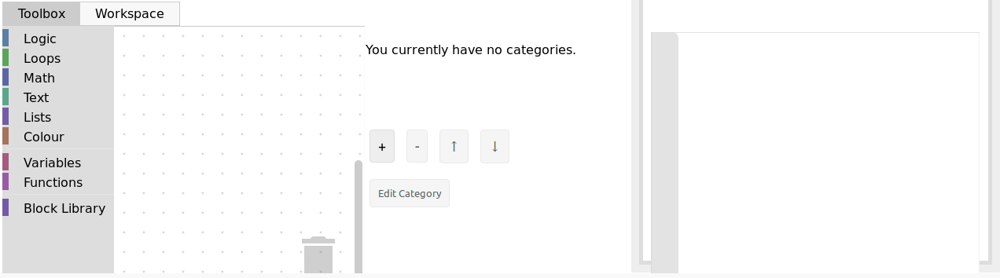

The left side is where you can configure the tool, and the right side will display a live preview of what you did so far. The left side has two tabs : the toolbox will hold the pool of blocks that the student can use to solve the task. To add blocks, simply click on one category and drag/drop the block you want in the tab. Here is an example :

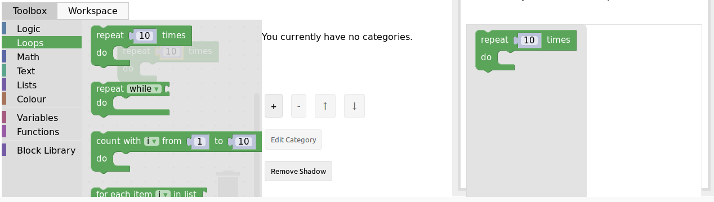

If you want to delete a block, simply drag it to the trashcan on the bottom right. Now, you can also add blocks to the workspace of the student, that will serve as a base for the exercice. Simply click on the "workspace" tab and drag/drop the same way.

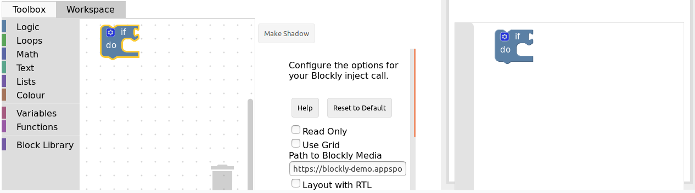

Let's now see an example of what can be done for a simple exercice.

Example : create the sum function (using the graphical interface)
-----------------------------------------------------------------

Here, we are in the case where we want the student to create a function, which means we have to provide him with it's signature in the workspace. Our Sum function needs to take in two parameters, the two numbers to sum (let's call them a and b), and return the resulting sum.

First, click the "Workspace" tab and open the "Function" category. Out of the three blocks, we need the functions that returns, which is the second block on the image here.

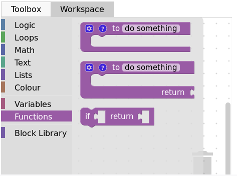

Now, configure the function. The wheel icons allow us to add parameters. Simply name your parameter (*x* by default), then connect the block into the right space, like so :

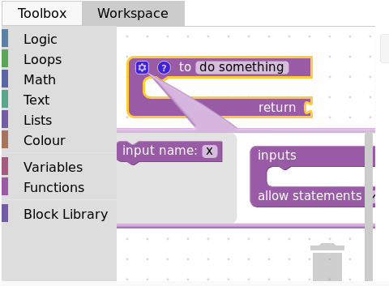
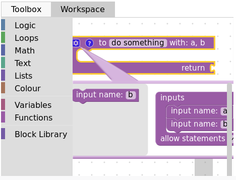

The *?* icon allows us to set a tooltip (text that show on mouseover) simply by typing in the field :

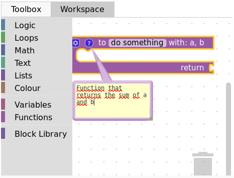

Finally, we have to name our function, changing the *do somthing* into what we want, here, *Sum* :

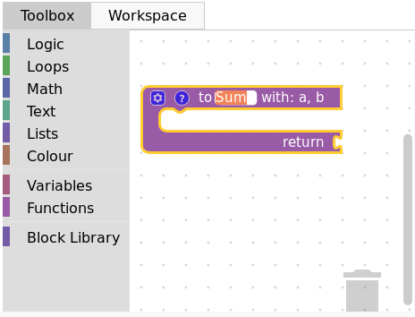

Now, let's create a variable to hold the result. Click on the "Variables" category and select "create variable". Input your variable name, "result" for example, and it will be available in the category :

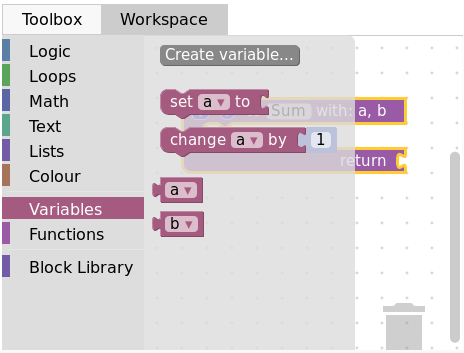
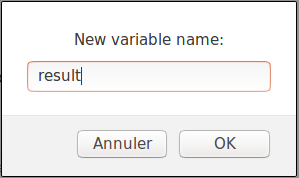
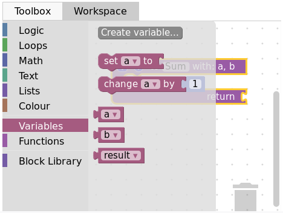

Finally, select the corresponding block and plug it into the "return" spot. Here is our basic workspace done, with the preview :

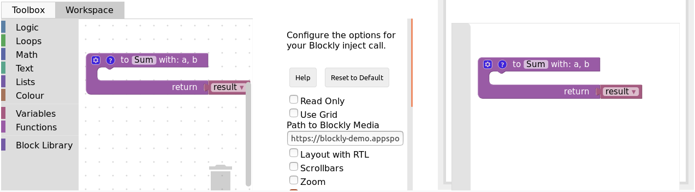

Now, it is time to create the toolbox. Click on the corresponding tab, and select the blocks that you want for the task. In our case, we first need to re-create all the previous variables, the same way as we did for the *result* one (clicking on create variable). Here is what we end up with :

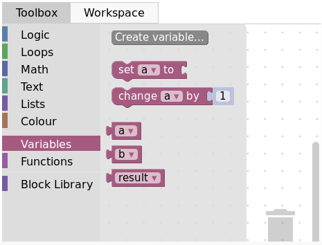

Then, we want the *set* block, so we drag it to the toolbox. Using the arrow next to the variable name, we can select the variable we want by default (*result* in our case) :

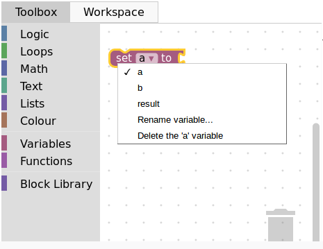
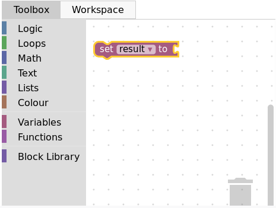

Then, we add the two previously created variables "a" and "b" as well. Finally, we want the sum operator from the math category :

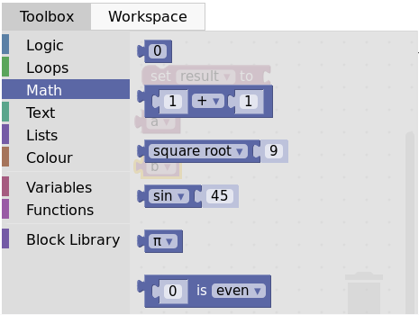

And here is the final product with the preview :

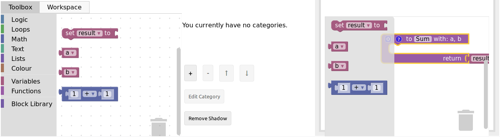

Click close, then save, and you are done with the graphical interface part of the task creation. You can now visualize your task on INGInious and connect blocks, but there is no correction or feedback yet. Here is what it will look like to the student :

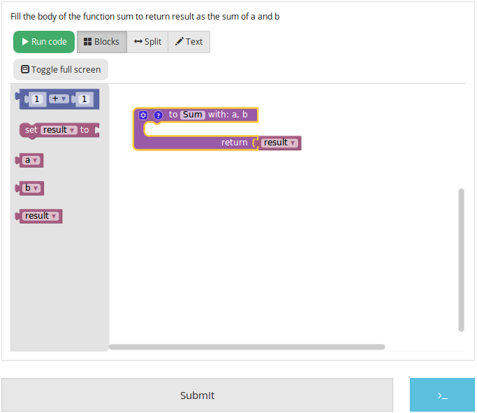

For the feedback, you'll have to create a ``run`` and a file that contains the task correction. Let's start with that one, that we will call ``sum.py``. It has to first get the student's code with an instruction like this : ``@@subProblemID@@``. Then, you will be able to call the created function with it's name (here "Sum"), and then run any tests you want. To comply with the usual INGInious run file, you have to output "True" if the tests pass, and some feedback followed by ``exit()`` for a failure. The following code is an example for our sum function :

.. code-block:: python
    
    #!/bin/python3
    #Open source licence goes here

    from contextlib import redirect_stdout
    import random

    @@Sum@@ #The id of your subproblem goes here

    if __name__ == "__main__":
        random.seed(55)
        for j in range(6): #let's test 6 times
            a = random.randint(0,10)
            b = random.randint(0,10)
            result = Sum(a, b)
            if(result != (a+b)):
                print("The sum you returned for the values " + str(a) + " and " + str(b) + 
                " is " + str(result) + " when the correct answer is " + str(a+b) + ".")
                exit()
        print("True")

For such a simple task, the basic ``run`` file is sufficient, with only two lines to modify, where you will have to put the name of your correction file. Here is the corresponding code for our sum task:

.. code-block:: python
    
    #!/bin/python3
    #Open source licence goes here

    import os
    import subprocess
    import shlex
    from inginious import feedback
    from inginious import input

    if __name__ == "__main__":
        input.parse_template("sum.py") #Replace sum.py by your filename on this line and the next
        p = subprocess.Popen(shlex.split("python3 sum.py"), stderr=subprocess.STDOUT, stdout=subprocess.PIPE)
        make_output = p.communicate()[0].decode('utf-8')
        if p.returncode:
            feedback.set_global_result("failed")
            feedback.set_global_feedback("Your code could not be executed. Please verify that all your blocks are correctly connected.")
            exit(0)
        elif make_output == "True\n":
            feedback.set_global_result("success")
            feedback.set_global_feedback("You solved the task !")
        else:
            feedback.set_global_result("failed")
            feedback.set_global_feedback("You made a mistake ! " + make_output)

Those two files need to go in your task folder, and the task creation is complete !

Example : create the sum function by hand
-----------------------------------------

Both the toolbox and the workspace can also be created by hand (using xml code) when clicking on the "Edit toolbox XML" and "Edit workspace XML" buttons. We'll go over how to configure those two to acheive the same set up as the previous example.

First, xml tags must surround every other lines in both the toolbox and the workspace, like this :

.. code-block:: xml

    <xml xmlns="http://www.w3.org/1999/xhtml">
    </xml>

Then, for the toolbox, we need the variables *a*, *b* and *result*. The code for one variable is the following, only the content of the ``field`` tag changes to indicate the variable name. Here is the code for variable *a* :

.. code-block:: xml

  <block type="variables_get">
    <field name="VAR">a</field>
  </block>

We also need the sum operator block code, which is the following :

.. code-block:: xml

    <block type="math_arithmetic">
    <field name="OP">ADD</field>
    <value name="A">
      <shadow type="math_number">
        <field name="NUM">1</field>
      </shadow>
    </value>
    <value name="B">
      <shadow type="math_number">
        <field name="NUM">1</field>
      </shadow>
    </value>
  </block>

Each block will have different code, that you can find either online or by using the graphical interface. You can also customize a block by modifying the values (changing *ADD* for *MINUS* in the ``field`` tag will give you a minus operator block, for example).

To recapitulate, this is the full code for the toolbox :

.. code-block:: xml

    <xml xmlns="http://www.w3.org/1999/xhtml">
      <block type="math_arithmetic">
        <field name="OP">ADD</field>
        <value name="A">
          <shadow type="math_number">
            <field name="NUM">1</field>
          </shadow>
        </value>
        <value name="B">
          <shadow type="math_number">
            <field name="NUM">1</field>
          </shadow>
        </value>
      </block>
      <block type="variables_set">
        <field name="VAR">result</field>
      </block>
      <block type="variables_get">
        <field name="VAR">a</field>
      </block>
      <block type="variables_get">
        <field name="VAR">b</field>
      </block>
      <block type="variables_get">
        <field name="VAR">result</field>
      </block>
    </xml>

Now, for the workspace, we need our function again. The arguments are specified in the ``mutation`` tag, the name under ``name`` and the tooltip under ``comment``. Finally, our result variable is specified by a special ``value`` tag, with the name *RETURN*. Here is the code for the workspace.

.. code-block:: xml

    <xml xmlns="http://www.w3.org/1999/xhtml">
      <block type="procedures_defreturn" deletable="false">
        <mutation>
          <arg name="a"></arg>
          <arg name="b"></arg>
        </mutation>
        <field name="NAME">Sum</field>
        <comment pinned="false" h="80" w="160">Return the sum of values a and b…</comment>
        <value name="RETURN">
          <block type="variables_get">
            <field name="VAR">result</field>
          </block>
        </value>
      </block>
    </xml>

At this point, we have the exact same result as in the previous example. But modifying the toolbox by hand might give you a finer control over the final display. For example, we could create a *Variable* and a *Math* category, which will make the display lighter. This can be done with ``category`` tags, like so :

.. code-block:: xml

    <xml xmlns="http://www.w3.org/1999/xhtml">
      <category name="Math">
        <block type="math_arithmetic">
          <field name="OP">ADD</field>
          <value name="A">
            <shadow type="math_number">
              <field name="NUM">1</field>
            </shadow>
          </value>
          <value name="B">
            <shadow type="math_number">
              <field name="NUM">1</field>
            </shadow>
          </value>
        </block>
      </category> 
      <category name="Variables"> 
          <block type="variables_set">
            <field name="VAR">result</field>
          </block>
          <block type="variables_get">
            <field name="VAR">a</field>
          </block>
          <block type="variables_get">
            <field name="VAR">b</field>
          </block>
          <block type="variables_get">
            <field name="VAR">result</field>
          </block>
      </category>
    </xml>

Here is the result from the student's point of view :

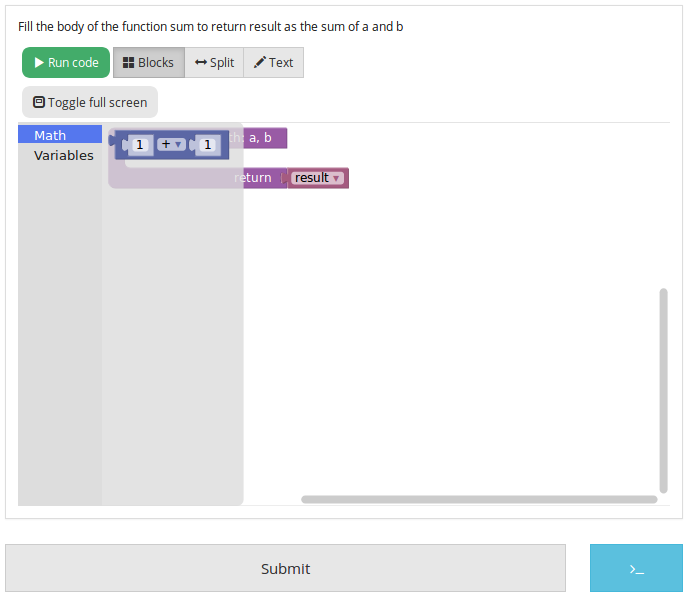
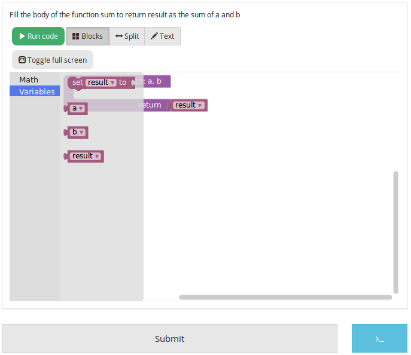

To get the full documentation about what can be acheived when modifying the toolbox manually, head to `this link <https://developers.google.com/blockly/guides/configure/web/toolbox>`_ (Google documentation).

Example : an "only workspace" task
----------------------------------

When creating a Blockly course, you might want your student to only re-order the blocks that are on the workspace rather than using a toolbox. This example will show you how to acheive that with the graphical interface. Here, we will take the very simple example of a function counting the number of occurence of a number n in a list and returns it.

First, open the graphical editor, click on the workspace tab and create a function that takes two parameters *list* and *n*, and returns a value *return* (if you are not familiar with the graphical interface use, refer to `Example : create the sum function (using the graphical interface)`_)

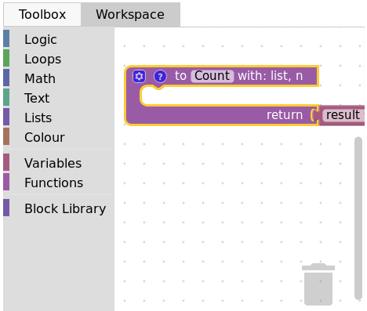

Then, from the *Variables* category, take the "set result to" block, and set it as the first block in the body of the function. From the *Math* category, get the "0" block, to first set result to zero. Here is the current progress :

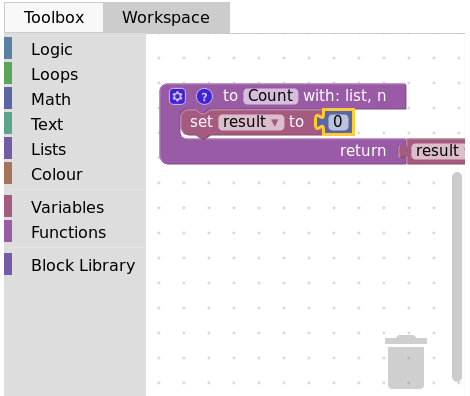

Next, from the *Loops* category, get the "for each item in list" block, plug it under the last one, and get the *list* variable to add it into the bloc :

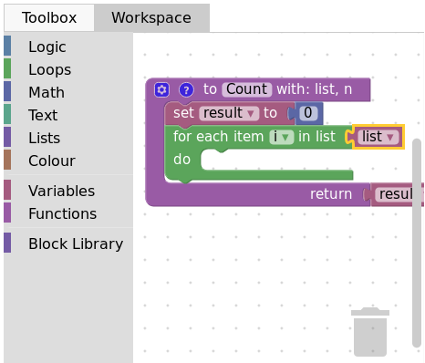

Add the "if" condition from the *Logic* category, and create our boolean `i == n` with blocks from *Logic* and *Variables*

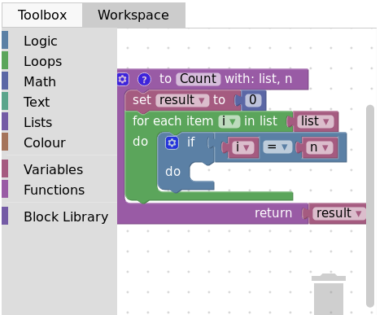

Finally, get the "change result by" block from the *Variables* sections and connect it to the body of the if. This is our correct function :

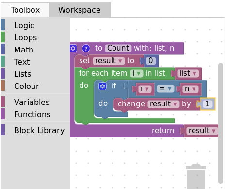

Now, we can purposefully add problems that the sudent will have to solve. We could change the boolean `==` to something else, or, in our case, move the "set result to 0" block inside the loop body, like this :

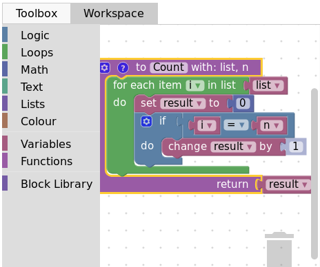

Here is what the student will see on INGInious :

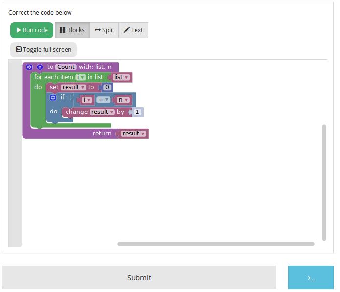

Again, we need to create a `run` file (same as the last one, will not be detailed here) and a correction file. Here is the code for the last one :

.. code-block:: python
    
    #!/bin/python3
    # Open source licence goes here
    from contextlib import redirect_stdout
    import random

    @@count@@

    def countList(List, n):
      res = 0
      for i in List:
        if i == n:
            res += 1
      return res

    if __name__ == "__main__":
        random.seed(55)
        for i in range(6): #6 tests
            List = []
            for j in range(15): #lists of 15 elements
                List.append(random.randint(0,10))
            n = random.randint(0,10)
            correct = countList(List, n)
            output = Count(List, n)
            if(correct != output):
                print("For the list "+str(List)+ " and the number "+str(n)+ " you have returned " 
                + str(output) + " when the correct answer is " + str(correct) + ".")
                exit()
        print("True")

To make the correction and feedback easier, we defined a function giving the correct answer, and compare this function's result the the student one; and run a few tests on random inputs. With the basic run file and this one in your task folder, it is complete.