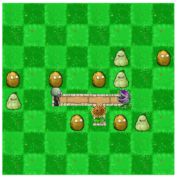
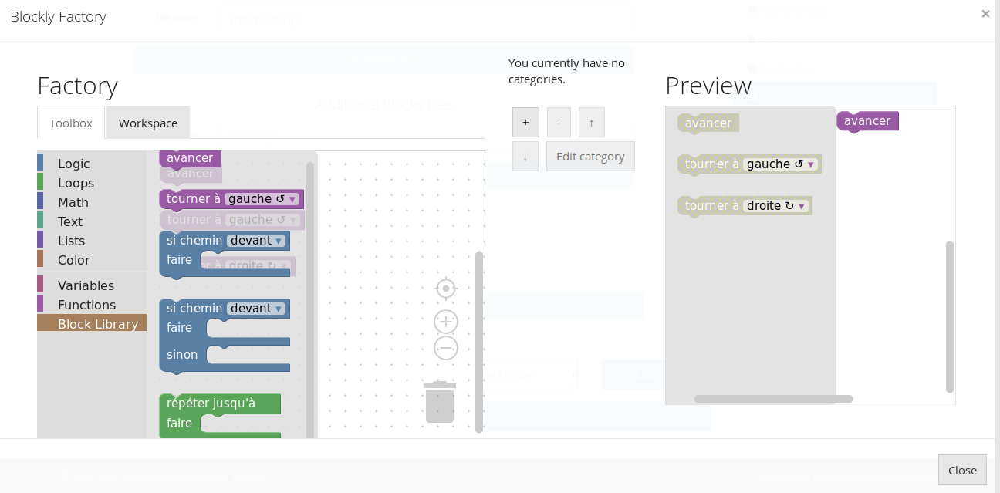

How to create a maze Blockly task ?
===================================

The easiest way to create such a task is to start from a very basic already existing task, and modify the files according to what we want. Zipped examples can be found at `this link <https://github.com/CelineDknp/JobBlockly/tree/master/BaseExercices>`_ (currently, only the visuals with the pegman and the zombie are there, but more are to come). We will describe the content of each files further in this tutorial.

To start, unzip the files of your choice into the course directory. You can freely change the directory name (it must **not** contain spaces), the task name and instructions, etc...

Now, to edit the maze itself, open the file ``maze.js`` under ``yourTask/public``. If you wish to change the graphical look of the maze, head to :doc:`this part <../VisualDocumentation>`  of the documentation to learn how to do so. If not, we will start by the shape of the maze itself.

Scroll to the part of the file that defines ``Maze.map`` : the table represents the current maze. Above, in the ``Maze.SquareType`` variable, you can see which number correspond to which type of maze tile. By default, we have :

* 0 is an empty tile (that might be populated randomly with non-interactive decor) where the character can't go
* 1 is an open tile where the character can walk
* 2 is the tile where the character starts the game
* 3 is the goal to reach to win the game
* 4 is a tile with an obstacle that will kill the character if it walks on it
* 5 is a special value used if you want to make the start and goal tile the same one

Now, let's look at our maze by default :

.. code-block:: javascript

  Maze.map =
    [
        [0, 0, 0, 0, 0, 0, 0, 0],
        [0, 0, 0, 0, 0, 0, 0, 0],
        [0, 0, 0, 0, 0, 0, 0, 0],
        [0, 0, 0, 0, 0, 0, 0, 0],
        [0, 0, 2, 1, 1, 3, 0, 0],
        [0, 0, 0, 0, 0, 0, 0, 0],
        [0, 0, 0, 0, 0, 0, 0, 0],
        [0, 0, 0, 0, 0, 0, 0, 0]
    ];

The maze is simply a straight line with three steps forward to take in order to win. We can see that more visually in the INGInious task :

Let's, for example, modify it to have a two empty tiles, then a turn to the goal and an obstacle where the previous goal was. Modify ``maze.js`` to this :

.. code-block:: javascript

  Maze.map =
    [
        [0, 0, 0, 0, 0, 0, 0, 0],
        [0, 0, 0, 0, 0, 0, 0, 0],
        [0, 0, 0, 0, 0, 0, 0, 0],
        [0, 0, 0, 0, 0, 0, 0, 0],
        [0, 0, 2, 1, 1, 4, 0, 0],
        [0, 0, 0, 0, 3, 0, 0, 0],
        [0, 0, 0, 0, 0, 0, 0, 0],
        [0, 0, 0, 0, 0, 0, 0, 0]
    ];

Hit save, reload the page and see the updated maze :

This is all the modifications that you will need to do in the ``maze.js`` file. The rest of the code handle the animations and visuals of the game, and should not be touched when creating new instances.

Now, to make our new maze correctable automatically, we need to edit the file ``maze.tpl.py`` (under the ``student`` directory) : the *MAP* variable should contain exactly the same array as the one we previously defined, which, in our case is :

.. code-block:: python

  MAP = [[0, 0, 0, 0, 0, 0, 0, 0],
       [0, 0, 0, 0, 0, 0, 0, 0],
       [0, 0, 0, 0, 0, 0, 0, 0],
       [0, 0, 0, 0, 0, 0, 0, 0],
       [0, 0, 2, 1, 1, 4, 0, 0],
       [0, 0, 0, 0, 3, 0, 0, 0],
       [0, 0, 0, 0, 0, 0, 0, 0],
       [0, 0, 0, 0, 0, 0, 0, 0]]

Then, change the line 106 to correspond to your subproblem name. By default, we have :

.. code-block:: python

  def student_code():
    @   @code@@

If our subproblem name is *example*, we need to change the value to :

.. code-block:: python

  def student_code():
    @   @example@@

The task should now work as expected. If you wish to add or remove blocks from the task, you can do so using the graphical user interface as you would for any other task. The blocks that are specific to a maze can be found under the *Block Library* category, and are defined in the file ``blocks.js`` (under ``public``), which should not be modified, except if you want to add new custom blocks to it. 

For the last files that where not yet mentionned, ``interpreter.js`` deals with internal animations, and should not be modified, as well as ``run.py`` (at the root of the task), which is simply a classical run file, as described earlier in this documentation.