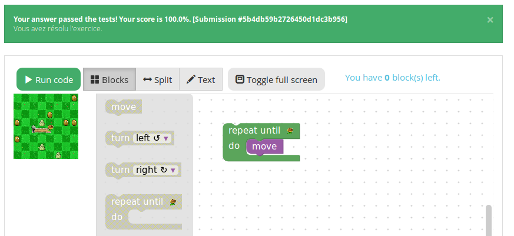
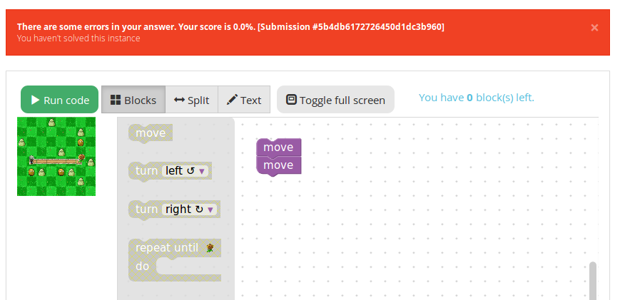
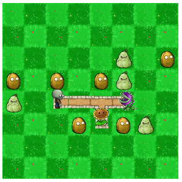
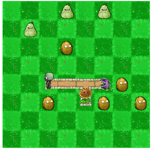
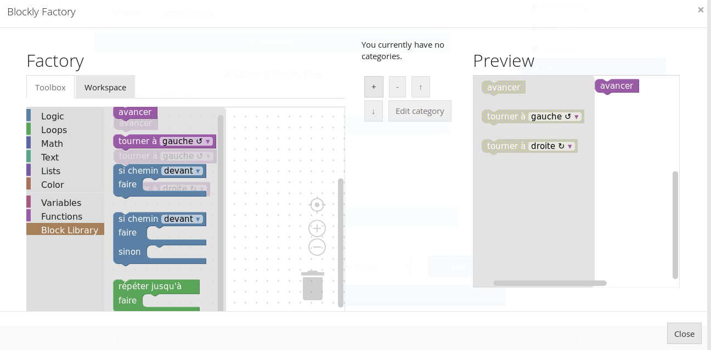
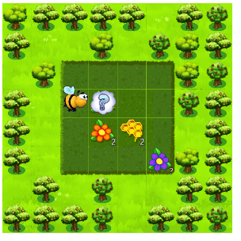
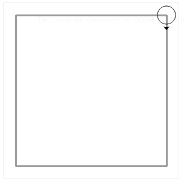
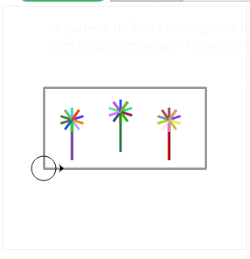

Blockly visual tasks
====================

Available types of tasks
------------------------
We created a few types of tasks that include a visual and an animations and work with the Blockly plugin. This section will describe each of them and how to use them.

Maze task
.........

The first type of task is a maze, where the student needs to go from a point A to a point B, following the allowed paths and eventually avoiding ennemies. Currently, two types of visuals are available for this task : pegman and zombie.

Collect and create task
.......................

The second type of task has the general layout of a maze, but the goal is to collect and/or create all items present on the map.

Drawing task
............

The final type of visual task require the student to draw shapes on a canvas, according to the instructions. 

Create a new instance of a task
...............................
The easiest way to create a new task of any of the described type is to start from a very basic already existing task, and modify the files according to what you want. Zipped examples can be found at `this link <https://github.com/CelineDknp/JobBlockly/tree/master/BaseExercices>`_. We will describe the conventions for each type of task further in this tutorial.

To start, unzip the files of your choice into the course directory. You can freely change the directory name (it must **not** contain spaces), the task name and instructions, etc...

Create a new maze task
------------------------

First, download the file `task_pvz <https://github.com/CelineDknp/JobBlockly/tree/master/BaseExercices>`_, `task_pegman <https://github.com/CelineDknp/JobBlockly/tree/master/BaseExercices>`_ or `task_4_ennemies <https://github.com/CelineDknp/JobBlockly/tree/master/BaseExercices>`_, unzip it to create a task and make any changes you want to the titles, instructions, etc...

The only file you have to edit to use this kind of task is ``maze_config.json`` under ``yourTask/public``. If you wish to change the graphical look of the maze, head to :doc:`this part <../VisualDocumentation>`  of the documentation to learn how to do so. If not, we will go over every element of the json file.

Here, we will only look at the ``map`` element of the file, since the visual part is covered by the other documentation. The first element is ``layout``, which is an array of arrays. Each array will represent a map that the student has to solve in this exercice. In our example, we have :

.. code-block:: json

  {
    "layout":[ 
              [[0, 0, 0, 0, 0, 0, 0, 0],
               [0, 0, 0, 0, 0, 0, 0, 0],
               [0, 0, 0, 0, 0, 0, 0, 0],
               [0, 0, 0, 0, 0, 0, 0, 0],
               [0, 0, 2, 1, 3, 0, 0, 0],
               [0, 0, 0, 0, 0, 0, 0, 0],
               [0, 0, 0, 0, 0, 0, 0, 0],
               [0, 0, 0, 0, 0, 0, 0, 0]],

              [[0, 0, 0, 0, 0, 0, 0, 0],
               [0, 0, 0, 0, 0, 0, 0, 0],
               [0, 0, 0, 0, 0, 0, 0, 0],
               [0, 0, 0, 0, 0, 0, 0, 0],
               [0, 2, 1, 1, 1, 1, 3, 0],
               [0, 0, 0, 0, 0, 0, 0, 0],
               [0, 0, 0, 0, 0, 0, 0, 0],
               [0, 0, 0, 0, 0, 0, 0, 0]]       
          ]
  }

The meaning of the numbers can be found in the item ``squareType``, that you should not have to modify except if you are adding new types of elements to the maze. We will go over them in more details here :

* 0 is an empty tile (that might be populated randomly with non-interactive decor) where the character can't go
* 1 is an open tile where the character can walk
* 2 is the tile where the character starts the game
* 3 is the goal to reach to win the game
* 4 is a tile with an obstacle that will kill the character if it walks on it
* 5 is a special value used if you want to make the start and goal tile the same one

Our two maps will, of course, not be displayed at the same time. They are there to ensure that the student doesn't hardcode the solution to the map he sees. You can add as much maps that you want, with a minimum of one.

When a student submit his code, the correction will test each map individually (in order). If they all pass, the student succeeded. In our example, it will look like this :

If some instance failed, a negative feedback is given and the failed instance is displayed :

Let's, for example, modify the first map to have two empty tiles, then a turn with an obstacle and the goal after the straight line. Modify ``layout`` to this :

.. code-block:: json

  {
    "layout":[ 
              [[0, 0, 0, 0, 0, 0, 0, 0],
               [0, 0, 0, 0, 0, 0, 0, 0],
               [0, 0, 0, 0, 0, 0, 0, 0],
               [0, 0, 0, 0, 0, 0, 0, 0],
               [0, 0, 2, 1, 1, 3, 0, 0],
               [0, 0, 0, 0, 4, 0, 0, 0],
               [0, 0, 0, 0, 0, 0, 0, 0],
               [0, 0, 0, 0, 0, 0, 0, 0]],

              [[0, 0, 0, 0, 0, 0, 0, 0],
               [0, 0, 0, 0, 0, 0, 0, 0],
               [0, 0, 0, 0, 0, 0, 0, 0],
               [0, 0, 0, 0, 0, 0, 0, 0],
               [0, 2, 1, 1, 1, 1, 3, 0],
               [0, 0, 0, 0, 0, 0, 0, 0],
               [0, 0, 0, 0, 0, 0, 0, 0],
               [0, 0, 0, 0, 0, 0, 0, 0]]       
          ]
  }

Hit save, reload the page and see the updated maze :

If you wish to change the orientation of the character at the start, change the ``startDirection`` item to one of the values *EAST* (the value our default file use), *SOUTH*, *WEST* or *SOUTH*. For example, here is the output with ``"startDirection":"WEST"`` :

If you feel like the animation speed is a little bit too quick or too slow, update the value of the ``animationSpeed`` item.

If you wish to change the subproblem id (not visible to user, so we would advise to not do it), you will have to modify the line 107 in the file ``yourtask/student/maze.tpl.py`` to correspond the name you picked. By default, we have :

.. code-block:: python

  def student_code():
    @   @code@@

If our subproblem name is *example*, we need to change the value to :

.. code-block:: python

  def student_code():
    @   @example@@

The task should now work as expected. If you wish to add or remove blocks from it, you can do so using the graphical user interface as you would for any other task. The blocks that are specific to a maze can be found under the *Block Library* category, and are defined in the file ``blocks.js`` (under ``public``), which should not be modified, except if you want to add new custom blocks to it. 

Create a new collect/create task
--------------------------------

First, download the file `task_bee <https://github.com/CelineDknp/JobBlockly/tree/master/BaseExercices>`_, unzip it to create a task and make any changes you want to the titles, instructions, etc...

Same as the maze task, the only file you have to edit for this type of task is ``maze_config.json`` under ``yourTask/public``. If you wish to change the graphical look of the task, head to :doc:`this part <../VisualDocumentation>`  of the documentation to learn how to do so. If not, we will go over every element of the json file.

Again, we will only look at the ``map`` element of the file. The first element is ``layout``, which is a double array (there is no multiple instances correction in this kind of task). As in the previous task, it represents the map, with ``squareType`` giving the details about the number. Since there is no goal point in this kind of task, the only types are :

* 0 is an empty tile (that might be populated randomly with non-interactive decor) where the character can't go
* 1 is an open tile where the character can walk
* 2 is the tile where the character starts the game

In our example, we have this map :

.. code-block:: json

  {
    "layout": [[0, 0, 0, 0, 0, 0, 0, 0],
               [0, 0, 0, 0, 0, 0, 0, 0],
               [0, 0, 1, 1, 1, 1, 0, 0],
               [0, 0, 2, 1, 1, 1, 0, 0],
               [0, 0, 1, 1, 1, 1, 0, 0],
               [0, 0, 1, 1, 1, 1, 0, 0],
               [0, 0, 0, 0, 0, 0, 0, 0],
               [0, 0, 0, 0, 0, 0, 0, 0]]
  }

The next item is the dictionnary ``specialCells``; which describes the elements to collect and create, as well as a special one to hide the spot. It has four entries which are arrays of dictionaries : *honey*, *redFlower*, *purpleFlower* and *cloud*; each containing one type of special element.

In our example, we have one honey, one red flower, one purple flower, one cloud and one element that is hidden underneath the cloud :

Each element has it's own characteristics, which will be detailed underneath

Honey or redFlower
..................

The honey is the element that the student will have to create, and the red flower is one of the element to collect.

Here is what is in the ``specialCells`` element for honey and redFlower :

.. code-block:: json

  {
    "honey":[
                {
                    "x":4,
                    "y":4,
                    "value":2
                }
            ],
    "redFlower":[ 
                {
                  "x":3,
                  "y":4,
                  "value":2
                },
                {
                  "x":3,
                  "y":3,
                  "value":2,
                  "or":"honey"
                }
            ]
  }

Each of those elements must have an ``x`` and ``y`` coordinates that will place them on the map, as well as a ``value`` representing how many time they must be collected or created (on the visual, it can be seen as the number on the right corner). Then, there is two optional arguments : 

* ``or`` followed by the name of the other element (either *honey* or *redFlower*), makes it so, when the map is generated by charging the page, this element will either be of it's type or the other one (a red flower or a honey).
* ``optional`` followed by the boolean ``true``, makes it so, when the map is generated, the element is present or not (at random) [1]_.

.. [1] This argument is common for all elements

PurpleFlower
............

The purple flower is the other element to collect, its value is in a specified range, and is denoted with a *?* before the animation starts.

The ``specialCells`` content is :

.. code-block:: json

  {
    "purpleFlower":[
                      {
                          "x":5,
                          "y":5,
                          "range":[0, 2]
                      }
            ]
  }

This element also has the ``x`` and ``y`` coordinates, but no value. Instead, it has the item ``range``, which specify that it's value will be an integer between 0 and 2 (included) in our example. It also has one non-required argument : 

* ``optional`` followed by the boolean ``true``, makes it so, when the map is generated, the element is present or not (at random) [1]_.

Cloud
............

This last element is used to hide parts of the map before the start of the animation (it will desapear as soon as the user clicks "run code").

The ``specialCells`` content is :

.. code-block:: json

  {
    "cloud":[
                {
                    "x":3,
                    "y":3
                }
            ]
  }

This element only has the ``x`` and ``y`` coordinates, as well as the ``optional`` argument [1]_.

As for the maze, if you feel like the animation speed is a little bit too quick or too slow, update the value of the ``animationSpeed`` item.

If you wish to change the subproblem id (not visible to user, so we would advise to not do it), you will have to modify the line 138 in the file ``yourtask/student/maze.tpl.py`` to correspond the name you picked. By default, we have :

.. code-block:: python

  def student_code():
    @   @code@@

If our subproblem name is *example*, we need to change the value to :

.. code-block:: python

  def student_code():
    @   @example@@

The task should now work as expected. If you wish to add or remove blocks from it, you can do so using the graphical user interface as you would for any other task. The blocks that are specific to a maze can be found under the *Block Library* category, and are defined in the file ``blocks.js`` (under ``public``), which should not be modified, except if you want to add new custom blocks to it. 

Create a new drawing task
-------------------------

First, download the file `task_artist <https://github.com/CelineDknp/JobBlockly/tree/master/BaseExercices>`_, unzip it to create a task and make any changes you want to the titles, instructions, etc...

Here is what our example looks like in INGInious. The circle with the arrow is the drawing utencil, is is referrenced further down as "the turtle" it moves (and draw) in the direction of the arrow.

For this kind of task, you will have to edit a few files (and eventually run a Python script). Let's first go over the json configuration file (under ``yourTask/public``), ``turtle_config.json``. Here is the content of our example :

.. code-block:: json

  {
    "startX":270,
    "startY":20,
    "startAngle":180,
    "strokeWidth":3,
    "strokeColour":"#000000",
    "colourSpecific":false,
    "radius":15,
    "animationRate":50,
    "width":290,
    "height":290,
    "imageSolution":true,
    "imageName":"solution.png"
  }

Let's detail each item :

* ``startX`` is the X coordinate on which the turtle will start. (0, 0) is the top left corner.
* ``startY`` is the Y coordinate on which the turtle will start.
* ``startAngle`` is the starting angle (0 is facing pure north, 180 pure south)
* ``strokeWidth`` is the width of the lines that will be drawn
* ``strokeColour`` is the start color of the turtle (the student can modify it)
* ``colourSpecific`` must be a boolean, and is true if the color of the line matters when correcting the exercice
* ``radius`` defines the radius of the turtle body
* ``animationRate`` defines the time (in ms) between frames
* ``width`` is the width of the canvas
* ``height`` is the height of the canvas
* ``imageSolution`` must be a boolean specifying if the solution to be drawn on the canvas is an image or not (true if it is)
* ``imageName`` not used if ``imageSolution`` is false, specify the name of the solution image

The second step is to define how the expected solution will be displayed to the user. You can either create the corresponding image using the script ``create_img.py`` or write the code in the ``turtle.js`` file. We will describe both methods.

Create solution image using `create_img.py`
...........................................

To use this script, you must have the Python module Pillow installed (see `this link <pillow.readthqedocs.io/en/3.1.x/installation.html>`_).

Then, write the solution to your exercice in the file ``create_img.py`` (from the line 95). The function names used by Blockly are available, so you can solve your exercice using blocks and copy/paste if you feel that this is easier for you [2]_. In our example, we have this :

.. [2] You will be able to reuse this code for the correction part. 

.. code-block:: python

  for i in range(4):
    moveForward(250)
    turnRight(90)

Finally, in your ``public`` directory, run ``python create_img.py``. The scripts creates your solution image named *solution.png* (you can rename it as long as you don't forget to change the name in the config file), and it will be used as long as the ``imageSolution`` boolean in the ``turtle_config.json`` file is set at true.

Write the solution code in `turtle.js`
......................................

If you pick that option, you must be aware that the solution to the exercice will be available to a student clever enough to find the correct Javascript file and read it carefully.

Open the file ``turtle.js`` in the public directory, and edit the function ``solution`` (line 24) to execute your solution using the Javascript versions of the functions used by Blockly (they are all in the form ``Turtle.function()``). In our case, we have :

.. code-block:: javascript

  var solution = function(){
      for(var i = 0; i < 4; i++){
          Turtle.moveForward(250);
          Turtle.turnRight(90);
      }
  }

Save the file, and this code will be used as long as the ``imageSolution`` boolean in the ``turtle_config.json`` file is set at false.

Write solution in the correction file
.....................................

The correction file, ``turtle.py`` (under the ``student`` directory), also need to have the correct code for the task. If you have picked the option of using the ``create_img.py`` script, you can simply copy/paste your code from line 21.

If you have picked the other option, you'll have to translate the Javascript solution code to Python, which is just a matter of translating the loop syntax, removing semicolons and the ``Turtle.`` part of a function call. Here is what we have in our example :

.. code-block:: python

  def solution():
    for i in range(4):
      moveForward(250)
      turnRight(90)

Now, you should have a working task. Again, if you wish to change the subproblem id (not visible to user, so we would advise to not do it), you will have to modify the line 16 in the file ``yourtask/student/turle.py`` to correspond the name you picked. By default, we have :

.. code-block:: python

  def student_code():
    @   @code@@

If our subproblem name is *example*, we need to change the value to :

.. code-block:: python

  def student_code():
    @   @example@@

Finally, you can also add some decor to the INGInious display to the student (that will not be considered when correcting). To do so, refer to the next section.

Add decoration to the student display
.....................................

You may want to spice up the display with some decor, like you can see on this image :

To do so, you'll have to edit the ``turtle.js`` file (under the public directory). Go to the ``decoration`` function, and add any Javascript version of the Blockly code (eventually creating helper functions). The result will be drawn from the same starting point specified in ``turtle_config.json`` and will be shown in the task. The code for our example here is :

.. code-block:: javascript

  //Code of the decor
  var decoration = function(){
    //Here, put the code for any decor, not part of the exercice
    Turtle.penUp();
    Turtle.move(35);
    Turtle.turnLeft(90);
    Turtle.move(10);
    Turtle.penDown();
    drawFlower();
    Turtle.penUp();
    Turtle.turnRight(90);
    Turtle.move(60);
    Turtle.turnLeft(90);
    Turtle.move(10);
    Turtle.penDown();
    drawFlower();
    Turtle.penUp();
    Turtle.turnRight(90);
    Turtle.move(60);
    Turtle.turnRight(90);
    Turtle.move(10);
    Turtle.turnRight(180);
    Turtle.penDown();
    drawFlower();
  }

  var drawFlower = function(){
    Turtle.penColour(randomColour());
    Turtle.moveForward(50);
    for (var i = 0; i < 11; i++) {
      Turtle.penColour(randomColour());
      Turtle.penDown();
      Turtle.turnRight(36);
      Turtle.moveForward(15);
      Turtle.penUp();
      Turtle.moveBackwards(15);
    }
    Turtle.turnLeft(36);
    Turtle.moveBackwards(50);
  }