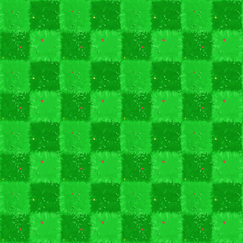
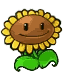
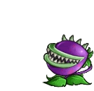

How to change the maze's visuals
================================

Files you will need
-------------------

Depending on the type of task you want to create visuals for, you will need different files. The following ones are common for all of them and have to be in the exact specified format.

A background representing an 8x8 board, in png format, for example the following :

A file representing all possible intersections of the path and, if wanted, two "passive" entities to populate the map in png.

.. image:: NeededVisuals/tiles.png
    :align: center

A sprite for the avatar in png, with the following format : 21 frames of equal size and equally spaced, with the character in the center of each one. The frames need to be ordered this way :

* The first (left) sprite is the character from the back. Then, we have a transition where it turns on it's right in three steps
* The next frame, the 5th one, is the character on it's right profile. Then, another transition with a turn to the right in three steps
* The 9th fame is then the character from the front. Again, the three next are a transition to the right.
* The 13th frame is the left profile, followed by the last transition, getting us to 16 images
* Finally, 5 images representing a walking animation (currently not used by the application, you can put any frame) to get to the 21.

.. image:: NeededVisuals/avatar.png
    :align: center

Files for a maze task
.....................

A marker representing the goal of the maze idle, when the character is on another tile. As every other "interactive" part of the maze, it is usually in gif, but a png would work as well

.. image:: NeededVisuals/goalIdle.gif
    :align: center

The marker when it is reached by the character and the game is won (gif or png)

Now, for the obstacles, there is two ways : either you provide just one type of ennemy that can attack from every "side", or you want more variety, and can create four ennemies, that are accessed from : the top, the bottom, the right and the left. No matter which you choose, you will need, for each ennemies and "idle" and a "attacking" image. For example, here we have an idle obstacle (when the character is on another tile), in gif or png :

.. image:: NeededVisuals/obstacleIdle.gif
    :align: center

The same obstacle when killing the character, ending the game (gif or png)

You may also add, but do not need to :

* mp3 and ogg files with a sound to be played when the character hit an obstacle
* mp3 and ogg files with a sound to be played when the character looses the game without hitting an obstacle 
* mp3 and ogg files with a sound to be played when the character wins the game

Particular case of Maze : APP0
,,,,,,,,,,,,,,,,,,,,,,,,,,,,,,

The type of task *APP0* is a particular case of a maze, where you do not have any animations for ennemies or goal (since the visuals are changing each year). Furthermore, there is no path drawn on the map (all free spaces are blank tiles), and there is an illustration for a wall. The json file is the following :

.. code-block:: json

  {
    "visuals":{
      "sprite":"avatar.png",
      "marker":"nedstark.png",
      "obstacleIdle":"wolf.png",
      "wall":"wall.png",
      "obstacleScale":1.2,
      "background":"testBackPlain.png",
      "graph":"black"
    },
  }

Files for a collect and create task
...................................

An item to collect that will have a fixed value (that do not change when refreshing the page):

.. image:: NeededVisuals/redFlower.png
    :align: center

An item to collect that have a changing value :

.. image:: NeededVisuals/purpleFlower.png
    :align: center

An item to create :

.. image:: NeededVisuals/honey.png
    :align: center

An item to hide some tiles, and a disapearing version of the item (you might need to refresh the page to see the animation):

.. image:: NeededVisuals/cloud.png
    :align: center

All of those files need to be put in the task folder, under : ``taskName/public/maze``

File to modify
---------------

The only file to modify is ``maze_config.json``, that you will find under ``taskname/public``. Here, we only consider the ``visual`` item (the other one concerns the layout of the task). Here is the common variables :

.. code-block:: json

  {
    "visuals":{
      "sprite":"avatar.png",
      "tiles":"tiles.png",
      "obstacleScale":1.7,
      "background":"background.png",
      "graph":false,
      "obstacleSound":[],
      "winSound":[],
      "crashSound":[]
    }
  }

Here, the ``background`` variable correspond to the 8x8 background, the ``tiles`` is all of the paths, and the ``sprite`` variable will hold your avatar image. ``obstacleScale`` scales items regarding the character, ``graph`` allows to draw a grid on the map, and the three last variables can hold your sounds if you have them.

To change a file, simply rename your file or change the name in the file, like so :

.. code-block:: json

  {
    "visuals":{
      "sprite":"myAvatarName.png",
      #Rest of the parameters
    }
  }

Files used by a maze
....................

If you are creating a maze, in ``visuals``, you have the following items :

.. code-block:: json

  {
    "visuals":{
      "marker":"goal.gif",
      "goalAnimation":"goal_win.gif",
      "obstacleIdle":"obstacleIdle.gif",
      "obstacleAnimation":"obstacle.gif"
    }
  }

The first two contains your end marker as well as a win animation, and are always the same. The next two concern the obstacle, and must be used as described if you have only one ennemy. If you have four, you must define them like so :

.. code-block:: json

  {
    "visuals":{
      "obstacleIdle":["obstacleDownIdle.gif", "obstacleLeftIdle.gif", "obstacleUpIdle.gif", "obstacleRightIdle.gif"],
      "obstacleAnimation":["obstacleDown.gif", "obstacleLeft.gif", "obstacleUp.gif", "obstacleRight.gif"]
    }
  }

The order you put your animations in is very important, and must be like so : obstacle when the character is comming from a tile down it, from a tile to it's left, from up it, from a tile to it's right. Of course, it must correcpond to the other version.

Files used by collect and create
................................

If you are creating a collect and create task, you have the following additional variables :

.. code-block:: json

  {
    "visuals":{
        "redFlower":"redFlower.png",
        "purpleFlower":"purpleFlower.png",
        "honey":"honey.png",
        "cloud":"cloud.png",
        "cloudAnimation":"cloud_hide.gif"
    }
  }

The variables correspond to :

* redFlower : the collectable that has a fixed value
* purpleFlower : the collectable that has a variable value
* honey : the creatable item
* cloud : the item used to hide a tile
* cloudAnimation : the animation revealing the tile