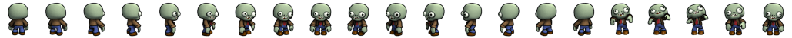

How to change the maze's visuals
================================

Files you will need
-------------------

First, you will need all those files, in the exact specified format.

A background representing an 8x8 board, in png format, for example the following :

.. image:: NeededVisuals/background.png
    :align: center

A file representing all possible intersections of the path and, if wanted, two "passive" entities to populate the map in png.

.. image:: NeededVisuals/tiles.png
    :align: center

A sprite for the avatar in png, with the following format : 21 frames of equal size and equally spaced, with the character in the center of each one. The frames need to be ordered this way :

* The first (left) sprite is the character from the back. Then, we have a transition where it turns on it's right in three steps
* The next frame, the 5th one, is the character on it's right profile. Then, another transition with a turn to the right in three steps
* The 9th fame is then the character from the front. Again, the three next are a transition to the right.
* The 13th frame is the left profile, followed by the last transition, getting us to 16 images
* Finally, 5 images representing a walking animation (currently not used by the application, you can put any frame) to get to the 21.

A marker representing the goal of the maze idle, when the character is on another tile. As every other "interactive" part of the maze, it is usually in gif, but a png would work as well

.. image:: NeededVisuals/goalIdle.gif
    :align: center

The marker when it is reached by the character and the game is won (gif or png)

.. image:: NeededVisuals/goal.gif
    :align: center

An obstacle idle, when the character is on another tile (gif or png)

.. image:: NeededVisuals/obstacleIdle.gif
    :align: center

The obstacle when killing the character, ending the game (gif or png)

.. image:: NeededVisuals/obstacle.gif
    :align: center

You may also add, but do not need to :

* mp3 and ogg files with a sound to be played when the character hit an obstacle
* mp3 and ogg files with a sound to be played when the character looses the game without hitting an obstacle 
* mp3 and ogg files with a sound to be played when the character wins the game

All of those files need to be put in the task folder, under : ``taskName/public/maze``

Files to modify
---------------

The only file to modify is ``maze.js``, that you will find under ``taskname/public``. At the beginning (line 37 to 52), you will have to tweak a few parameters of the variable *Maze.SKIN* and to replace the names of the files with your own files, like so :

.. code-block:: python

  Maze.SKIN = {
  	sprite: task_directory_path + 'maze/avatar.png',
  	#Rest of the parameters
  }

Will become :

.. code-block:: python

  Maze.SKIN = {
    sprite: task_directory_path + 'maze/myAvatarName.png',
    #Rest of the parameters
  }

Here is a break down of all the variables and what they correspond to :

* sprite: your avatar
* tiles: the tiles to show the paths
* marker: the marker or goal of the maze when idle
* goalAnimation: the marker when the game is won
* obstacleIdle: the obstacle when idle
* obstacleAnimation: the obstacle killing the character
* obstacleScale: the scale of the obstacle regarding the maze, the higher the bigger
* background: the background for the paze (png)
* graph and look, no need to modify
* obstacleSound: both sounds file for when the character hits an obstacle or ``[""]`` if you don't want any
* winSound: both sounds file for when the character wins de game or ``[""]`` if you don't want any
* crashSound: both sounds file for when the character looses the game or ``[""]`` if you don't want any
* crashType: to not modify